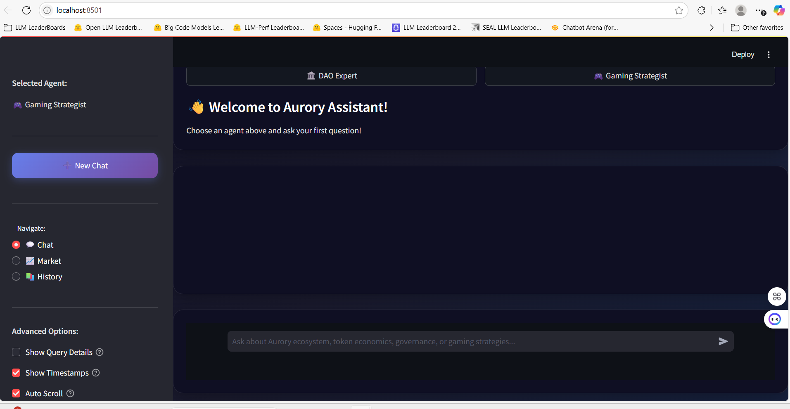

# Play-to-Earn (P2E) Economic Strategy Assistant

This project is a chatbot developed to provide analysis and strategic consultancy for the **Play-to-Earn (P2E)** gaming ecosystem. It is targeted at developers, players, DAO members, and community analysts. Currently, it is in the MVP stage and developed based on data from the **Aurory** game in the Solana ecosystem.

The project contains two main expert agents:

- **DAO Expert**  
  Analyzes DAO governance proposals.

- **Gaming Strategist**  
  Offers guidance on token economics, NFT marketplace, and in-game earning mechanisms.

---
## Technical Architecture

## Data Modeling and Transfer

### 1. Data Collection
- Wallet, NFT item, and transaction data are collected via `Helius` and `Magic Eden API`.
- DAO council information is accessed using `BeautifulSoup`.
- Collected data is converted to `.csv` format and imported into Neo4j.

### 2. Data Enrichment
- Game mechanics and tokens (AURY, XAURY, etc.) are manually added into Neo4j.
- Additional features (e.g., `levelId`) are synthetically added based on certain rules.

### 3. Embedding Data
- Data sources used for vector-based search:
  - PDFs of DAO proposals
  - Tweets fetched via Twitter API
  - Aurory news site contents (scraped using BeautifulSoup)
- All related scripts and data files are located in the `Data/` folder.

### Neo4j Schema Visualization

---

## Vector Embedding and Semantic Search

### Content Analysis and Classification
- `classify_event_type`: Classifies news by event type (e.g., partnership, tokenomics, event).
- `assess_economic_impact`: Rates the economic impact of news on a scale of 1–5.
- `analyze_tweet_economy`: Detects tokens mentioned in tweet content.
- `assess_tweet_impact`: Analyzes economic impact and sentiment of tweets.

### Semantic Search
- Filters: document type, economic impact score, DAO proposal ID, author, token name.

## Automatic Relationship Mapping (Neo4j)

Relationship types established between nodes such as `Document`, `Token`, `Proposal`, `GameMechanic` based on analysis results are explained below:

| Relationship Type       | Description |
|------------------------|-------------|
| **DESCRIBES**          | Created when a `Document` node defines a `Proposal`. |
| **DISCUSSES**          | Created if a `Document` discusses a specific `Token`. General association. |
| **POTENTIAL_IMPACT**   | Connects a `Document` or tweet with high economic impact to the relevant `Token` node. |
| **REFERENCES**         | Created when a `Document` contains information about a `GameMechanic`. |
| **MENTIONS**           | Created if a `Document` refers to a `Proposal`. |
| **ABOUT**              | Connects a `Document` directly related to a `Token`. Usually represents the main topic of the news. |

---

## General Features

| Feature                     | Description |
|-----------------------------|-------------|
| **Agents**                  | Two AI agents specialized for DAO and gaming strategies |
| **Neo4j Knowledge Graph**    | Models economic relationships in a graph database for advanced analysis |
| **Semantic Document Search**| Meaning-based search for more accurate results |
| **Real-time Market Data**    | Current price and transaction volume information for NFT collections (via Magic Eden API) |
| **Interactive Chat Interface**| User-friendly and intuitive UI built with Streamlit |
| **Chat History**             | Message history logging, viewing, and search capabilities |

---
## Prerequisites for Installation
- Python 3.9+
- Neo4j Database: A running Neo4j instance via Neo4j Desktop or Docker is required.
- OpenAI API Key: An API key is needed to access OpenAI services.

## Notes
- This project is only an MVP prototype.
- OpenAI’s `text-embedding-ada-002` model is used for vector embeddings.
- Neo4j database version must be at least 4.4.0, otherwise some features may not work.

